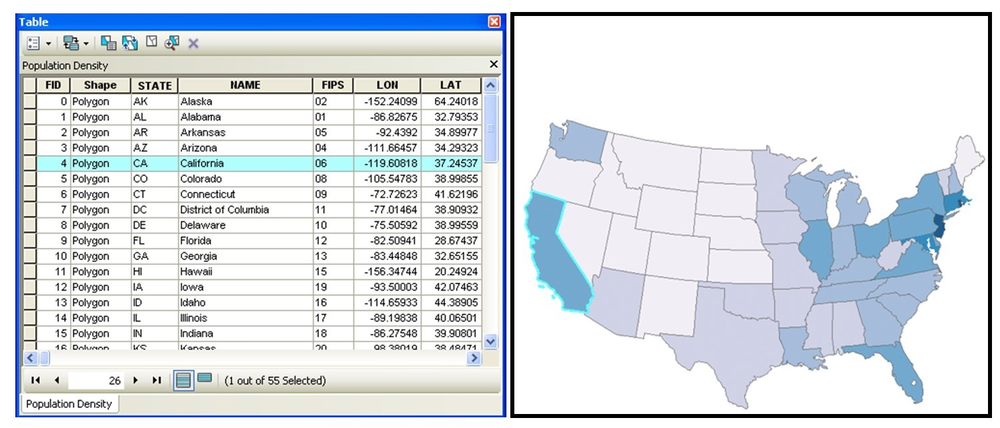

# Μοντέλα Γεωχωρικών Δεδομένων που χρησιμοποιούνται στα ΣΓΠ

Προκειμένου να απεικονίσει κανείς τα φυσικά φαινόμενα του πραγματικού κόσμου, πρέπει πρώτα να καθορίσει πώς να αναπαραστήσει καλύτερα τον γεωγραφικό χώρο. Τα **μοντέλα δεδομένων** είναι ένα σύνολο κανόνων ή/και δομών τα οποία χρησιμοποιούνται για την περιγραφή και την αναπαράσταση διαφόρων πτυχών του πραγματικού κόσμου σε έναν υπολογιστή. 

---

Στα ΣΓΠ, δύο κύρια μοντέλα δεδομένων είναι διαθέσιμα για τη διαδικασία αυτή: τα **πλεγματικά μοντέλα δεδομένων (raster)** και τα **διανυσματικά μοντέλα δεδομένων (vector).**

Στόχος αυτής της ενότητας είναι η κατανόηση των χρήσεων και των εφαρμογών των πλεγματικών δεδομένων, των διανυσματικών μοντέλων δεδομένων στα Συστήματα Γεωγραφικών Πληροφοριών.

---

# Διανυσματικά μοντέλα δεδομένων

Ένα εξαιρετικά ευρέως χρησιμοποιούμενο μοντέλο αναπαράστασης γεωχωρικών δεδομένων είναι το **διανυσματικό μοντέλο δεδομένων (vector data model)**. Σε αυτό το μοντέλο ο χώρος δεν διαιρείται σε διακριτά κελιά πλέγματος, όπως στο πλεγματικό μοντέλο. Τα διανυσματικά μοντέλα δεδομένων χρησιμοποιούν σημεία και τα συσχετισμένα ζεύγη συντεταγμένων τους X και Y προκειμένου να αναπαραστήσουν τις κορυφές των χωρικών αντικειμένων, σαν να σχεδιάζονταν σε ένα χάρτη με το χέρι. Οι τιμές των ιδιοτήτων αυτών των αντικειμένων, αποθηκεύονται στη συνέχεια σε ένα ξεχωριστό σύστημα διαχείρισης δεδομένων. Οι χωρικές πληροφορίες και οι πληροφορίες των ιδιοτήτων αυτών των μοντέλων, συνδέονται μέσω ενός απλού αναγνωριστικού αριθμού ο οποίος αποδίδεται σε κάθε αντικείμενο ενός χάρτη.

---

Θεματικά και Γεωχωρικά δεδομένα ([Πηγή](https://open.lib.umn.edu/mapping/chapter/2-data/#footnote-397-1))

--- 

Στα ΣΓΠ υπάρχουν τρεις θεμελιώδεις διανυσματικοί τύποι: τα σημεία, οι γραμμές και τα πολύγωνα.

 ([Πηγή](https://saylordotorg.github.io/text_essentials-of-geographic-information-systems/s08-02-vector-data-models.html))

---
 
Τα σημεία (points) είναι μηδενικής διάστασης αντικείμενα τα οποία περιέχουν μόνο ένα ζεύγος συντεταγμένων και χρησιμοποιούνται συνήθως στη μοντελοποίηση μεμονωμένων και διακριτών χαρακτηριστικών −όπως κτήρια, πηγάδια, στύλοι ηλεκτρικής ενέργειας, θέσεις δειγμάτων κ.λπ. Τα σημεία έχουν μόνο την ιδιότητα της θέσης. Άλλοι τύποι σημειακών χαρακτηριστικών περιλαμβάνουν τον κόμβο (node) και την κορυφή (vertex). Συγκεκριμένα, ένα σημείο είναι ένα αυτόνομο χαρακτηριστικό, ενώ ένας κόμβος είναι μια τοπολογική διασταύρωση η οποία αντιπροσωπεύει ένα κοινό ζεύγος συντεταγμένων Χ, Υ μεταξύ διασταυρούμενων γραμμών ή/και πολυγώνων. Οι κορυφές ορίζονται ως τα σημεία καμπής κατά μήκος μιας γραμμής ή ενός πολυγωνικού χαρακτηριστικού, το οποίο δεν αποτελεί τομή γραμμών ή πολυγώνων. Τα σημεία μπορεί να διασυνδεθούν χωρικά για να δημιουργηθούν πιο σύνθετα αντικείμενα.

---

Οι γραμμές (lines) είναι μονοδιάστατα χαρακτηριστικά τα οποία αποτελούνται από πολλαπλά, ρητά συνδεδεμένα σημεία. Χρησιμοποιούνται για την αναπαράσταση γραμμικών γεωγραφικών χαρακτηριστικών, όπως δρόμοι, ρέματα, ρήγματα, όρια κ.λπ. και έχουν την ιδιότητα του μήκους. Οι γραμμές οι οποίες συνδέουν απευθείας δύο κόμβους αναφέρονται, μερικές φορές ως αλυσίδες (chains), ακμές (edges), τμήματα (segments) ή τόξα (arcs).

---

Τα πολύγωνα (polygons) είναι δισδιάστατα χωρικά χαρακτηριστικά τα οποία δημιουργούνται από μια σειρά από γραμμές οι οποίες σχηματίζουν ένα βρόχο (loop) για να δημιουργήσουν ένα «κλειστό» χαρακτηριστικό. Στην περίπτωση των πολυγώνων, το πρώτο ζεύγος συντεταγμένων (δηλαδή το πρώτο σημείο) στο πρώτο τμήμα γραμμής είναι το ίδιο με το τελευταίο ζεύγος συντεταγμένων στο τελευταίο τμήμα γραμμής (δηλαδή με το τελευταίο σημείο). Τα πολύγωνα χρησιμοποιούνται για την αναπαράσταση επιφανειακών γεωγραφικών χαρακτηριστικών όπως οι πόλεις, οι γεωλογικοί σχηματισμοί, οι λίμνες, οι εδαφικές τύποι, οι φυτοκοινωνίες κ.ο.κ. Έχουν τις ιδιότητες του εμβαδού και της περιμέτρου. Τα πολύγωνα ονομάζονται επίσης και «επιφάνειες».

---

# Πλεονεκτήματα και μειονεκτήματα του διανυσματικού μοντέλου δεδομένων
Σε σύγκριση με το πλεγματικό μοντέλο δεδομένων, τα διανυσματικά μοντέλα δεδομένων τείνουν να αποτελούν καλύτερες αναπαραστάσεις της πραγματικότητας λόγω της ορθότητας και της ακρίβειας των σημείων, των γραμμών και των πολυγώνων που αναπαριστούν, σε αντίθεση με τα τακτικώς διατεταγμένα κελιά του πλεγματικού μοντέλου. Ως αποτέλεσμα, τα διανυσματικά δεδομένα τείνουν να δείχνουν αισθητικά πιο αποδεκτά από τα πλεγματικά δεδομένα.

---

Τα διανυσματικά δεδομένα παρέχουν επίσης αυξημένες δυνατότητες αλλαγής της κλίμακας παρατήρησης και ανάλυσης. Καθώς κάθε ζεύγος συντεταγμένων το οποίο σχετίζεται με ένα σημείο, μια γραμμή και ένα πολύγωνο αντιπροσωπεύει μια απειροελάχιστα ακριβή θέση −αν και περιορίζεται από τον αριθμό των σημαντικών ψηφίων και/ή τις μεθοδολογίες απόκτησης δεδομένων−, η πολύ μεγάλη μεγέθυνση μιας διανυσματικής εικόνας δεν αλλάζει την εμφάνιση ενός διανυσματικού γραφικού με τον τρόπο τον οποίο το κάνει ένα πλεγματικό γραφικό.

---

Τα διανυσματικά δεδομένα τείνουν να έχουν πιο συμπαγή δομή, οπότε τα μεγέθη των αρχείων είναι συνήθως πολύ μικρότερα από τα αντίστοιχα πλεγματικά. Αν και οι δυνατότητες των σύγχρονων υπολογιστών έχουν ελαχιστοποιήσει τη σημασία της χρήσης αρχείων μικρών σε μέγεθος, τα διανυσματικά δεδομένα συχνά απαιτούν πολύ λιγότερο αποθηκευτικό χώρο στον υπολογιστή σε σύγκριση με τα πλεγματικά δεδομένα.

---

Τέλος, άλλο ένα πλεονέκτημα των διανυσματικών δεδομένων είναι ότι η τοπολογία είναι εγγενής στο διανυσματικό μοντέλο. Αυτή η τοπολογική πληροφορία έχει ως αποτέλεσμα την απλοποίηση στη χωρική ανάλυση (π.χ. στην ανίχνευση σφαλμάτων, στην ανάλυση δικτύου, στην ανάλυση εγγύτητας και στον χωρικό μετασχηματισμό ), όταν χρησιμοποιείται διανυσματικό μοντέλο.

---

Από την άλλη πλευρά, υπάρχουν δύο κύρια μειονεκτήματα του διανυσματικού μοντέλου δεδομένων. Πρώτον, η δομή των δεδομένων τείνει να είναι πολύ πιο πολύπλοκη από το απλό μοντέλο πλεγματικών δεδομένων. Καθώς η θέση κάθε κορυφής πρέπει να αποθηκεύεται ρητά στο μοντέλο, δεν υπάρχουν συντομεύσεις για την αποθήκευση δεδομένων όπως υπάρχουν για τα πλεγματικά μοντέλα (π.χ. οι μεθοδολογίες κωδικοποίησης μήκους διαδρομής και τετραδικού δέντρου). Δεύτερον, η υλοποίηση της χωρικής ανάλυσης μπορεί επίσης να είναι σχετικά περίπλοκη λόγω μικρών διαφορών στην ορθότητα και στην ακρίβεια μεταξύ των συνόλων δεδομένων . Ομοίως, οι αλγόριθμοι για τον χειρισμό και την ανάλυση διανυσματικών δεδομένων είναι πολύπλοκοι και μπορεί να απαιτήσουν αυξημένη υπολογιστική ισχύ, ιδίως όταν πρόκειται για μεγάλα σε μέγεθος σύνολα δεδομένων.