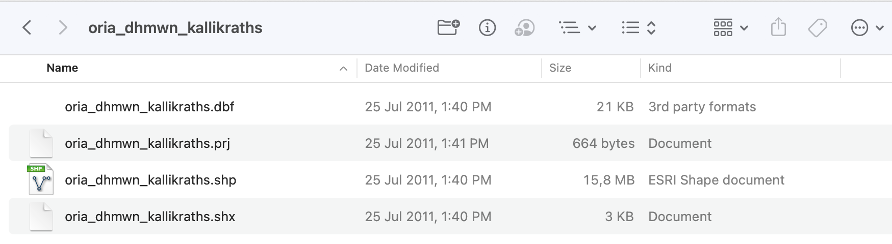

# Τα γεωχωρικά δεδομένα που θα χρησιμοποιηθούν

Τα γεωχωρικά δεδομένα που θα χρησιμοποιηθούν για τις ανάγκες του tutorial αφορούν στον Ελληνικό χώρο και προέρχονται από την γεωπύλη [geodata.gov.gr](https://geodata.gov.gr). Συγκεκριμένα θα πρέπει να κατεβάσετε τα ακόλουθα αρχεία:

1. [Πολύγωνα Δήμων σύμφωνα με την διοικητική διαίρεση "Καλλικράτης"](http://geodata.gov.gr/dataset/63786e9f-7be9-4d1e-99c9-48ff45d0962f/resource/6643d54a-f1af-4841-ad99-7a49a1d13650/download/oriadhmwnkallikraths.zip)
2. [Σιδηροδρομικό δίκτυο Ελλάδας](http://geodata.gov.gr/dataset/37468daf-d548-49f7-bce9-55b77661ea63/resource/2479563c-242f-4964-b9d4-60b179440c3b/download/sidhrodromikodiktyo.zip)
3. [Υδρογραφικό δίκτυο Ελλάδας](http://geodata.gov.gr/dataset/c07a4eb3-05a7-4bd2-9c25-1f1bb2f3f281/resource/abfca78b-5d9c-45d4-b8d3-bed102517aa0/download/ydrografikodiktyo.zip)
4. [Ακτογραμμή της Ελλάδας](http://geodata.gov.gr/dataset/d59c2895-49c0-416f-a77e-122459cc8cac/resource/1ba9f74e-eb7a-4d0d-8858-864218806dbc/download/aktogrammh.zip)
5. [Πρωτεύουσες των νομών Ελλάδας με πληθυσμιακά στοιχεία](http://geodata.gov.gr/dataset/f825534c-44fa-409a-8a42-6d8cfde9241b/resource/2001e4a8-e0cc-472b-9c04-65eebc6fd4e8/download/poleis.zip)

Στον φάκελο [Geodata](Geodata) έχουν αποθηκευθεί αντίγραφα των παραπάνω συμπιεσμένων αρχείων.

---

Όλα τα παραπάνω αρχεία είναι σε μορφότυπο ZIP, δηλαδή έχουν συμπιεσθεί ενώ περιέχουν παραπάνω του ενός αρχεία. Αυτό συμβαίνει γιατί όλα τα παραπάνω συμπιεσμένα αρχεία περιέχουν γεωχωρικά δεδομένα σε μορφότυπο **[ESRI Shapefile](https://en.wikipedia.org/wiki/Shapefile)**.

--- 

# Τι είναι το shapefile;

Ο μορφότυπος **shapefile** είναι ένας μορφότυπος (format) **διανυσματικών γεωχωρικών δεδομένων** (δεν παρέχει τη δυνατότητα αποθήκευσης raster δεδομένων). 

Είναι ένας εξαιρετικά διαδεδομένος μορφότυπος και υποστηρίζεται σχεδόν από όλα τα υφιστάμενα λογισμικά ΣΓΠ (αλλά και από άλλου είδους λογισμικά). Έχει αναπτυχθεί από την εταιρεία ESRI και αποτελεί ως επί το πλείστον ανοικτή προδιαγραφή (θα μπορούσε να ισχυριστεί κανείς ότι αποτελεί και [ανοικτό πρότυπο](https://gis.stackexchange.com/questions/142961/what-does-it-mean-that-shapefiles-are-mostly-open-specification/146630#146630) αλλά αυτό δεν είναι απολύτως βέβαιο) με απώτερο στόχο να ενισχύεται η διαλειτουργικότητα των δεδομένων μεταξύ λογισμικών της ESRI και λογισμικών άλλης προέλευσης. 

---

Σε ένα αρχείο shapefile μπορεί να αποθηκευθούν γεωχωρικά διανυσματικά αντικείμενα τα οποία μπορεί να είναι: 
- σημεία
- γραμμές
- πολύγωνα

Τα αντικείμενα αυτά θα μπορούσαν να αναπαριστούν γεωγραφικά αντικείμενα του πραγματικού κόσμου. 

Υπόψη ότι σε ένα αρχείο shapefile μπορεί να αποθηκευθεί μόνον ένα είδος γεωμετρίας: σημειακή γεωμετρία ή γραμμική ή πολυγωνική, με άλλα λόγια δεν επιτρέπεται η ανάμιξη διαφορετικών ειδών γεωμετρίας.

---

Κάθε shapefile ουσιαστικά αποτελείται από περισσότερα του ενός αρχεία στον υπολογιστή. Συνεπώς, παρόλο τον ενικό αριθμό που δηλώνει μάλλον παραπλανητικά το όνομά του, ένα shapefile θα αποτελείται κατ'ελάχιστο από **τρία αρχεία με συγκεκριμένες προεκτάσεις**, ενώ προαιρετικά μπορεί να υπάρχουν και αρχεία άλλων προεκτάσεων. Όλα αυτά τα αρχεία θα πρέπει οπωσδήποτε να έχουν **το ίδιο όνομα** (και να διαφέρουν ως προς τις προεκτάσεις τους μόνον).

---

Τα **τρία υποχρεωτικά αρχεία** που πρέπει να έχει ένα shapefile προκειμένου να είναι έγκυρο έχουν τις εξής προεκτάσεις:
- **.shp**: Σε αυτό το αρχείο αποθηκεύεται η καθαυτή η γεωμετρία του κάθε γεωγραφικού αντικειμένου
- **.shx**: Σε αυτό το αρχείο αποθηκεύεται ένας δείκτης της θέσης της γεωμετρίας στο αρχείο .shp, κάτι που επιτρέπει την επιτάχυνση της αναζήτησης στο αρχείο της γεωμετρίας
- **.dbf**: Αυτό το αρχείο αποτελεί ουσιαστικά έναν πίνακα: κάθε γραμμή αντιστοιχεί σε ένα γεωγραφικό αντικείμενο και κάθε στήλη σε μία ιδιότητά του γεωγραφικού αντικειμένου (attribute).

---

Άλλα προαιρετικά αρχεία που θα μπορούσε να έχει ένα shapefile (συναντώνται αρκετά συχνά αλλά όχι πάντα) έχουν τις παρακάτω προεκτάσεις:
- .prj: σε αυτό αποθηκεύονται τα στοιχεία της χαρτογραφικής προβολής (και του συστήματος αναφοράς)
- .sbn και .sbx: σε αυτά τα αρχεία αποθηκεύεται ένα χωρικό ευρετήριο των γεωγραφικών αντικειμένων
- .shp.xml ή .xml: αυτό το αρχείο συνήθως περιέχει τα **μεταδεδομένα** σε μορφή XML
- .cpg: χρησιμοποιείται για τον προσδιορισμό της κωδικοσελίδας με την οποία είναι αποθηκευμένα τα δεδομένα στο αρχείο .dbf. Η κωδικοσελδία ουσιαστικά προσδιορίζει την κωδικοποίηση των χαρακτήρων που πρέπει να χρησιμοποιηθεί

---

Τέλος, μπορεί να υπάρχουν και αρχεία με τις παρακάτω προεκτάσεις (συναντώνται πιο σπάνια) τα οποία μπορεί να μην υποστηρίζονται από όλα τα λογισμικά ΣΓΠ:
- .fbn και .fbx: ένας χωρικός δείκτης των χαρακτηριστικών που είναι μόνο για ανάγνωση
- .ain και .aih: δείκτης χαρακτηριστικών των ενεργών πεδίων ενός πίνακα
- .ixs: δείκτης γεωκωδικοποίησης για σύνολα δεδομένων ανάγνωσης-εγγραφής
- .mxs: ένα ευρετήριο γεωκωδικοποίησης για σύνολα δεδομένων ανάγνωσης-εγγραφής (μορφή ODB)
- .atx: ένα ευρετήριο χαρακτηριστικών για το αρχείο .dbf 
- .qix: ένα εναλλακτικό χωρικό ευρετήριο

---

Σε αυτό το παράδειγμα shapefile με όνομα "oria_dhmwn_kallikratis" βλέπουμε ότι υπάρχουν τα τρία βασικά αρχεία (.shp. .shx, .dbf) και επιπλέον υπάρχει και ένα προαιρετικό (.prj)

---

# Αναφορές
- [ESRI (July 1998). "ESRI Shapefile Technical Description" (PDF).](http://www.esri.com/library/whitepapers/pdfs/shapefile.pdf)
- [Wikipedia article about the Shapefile](https://en.wikipedia.org/wiki/Shapefile)