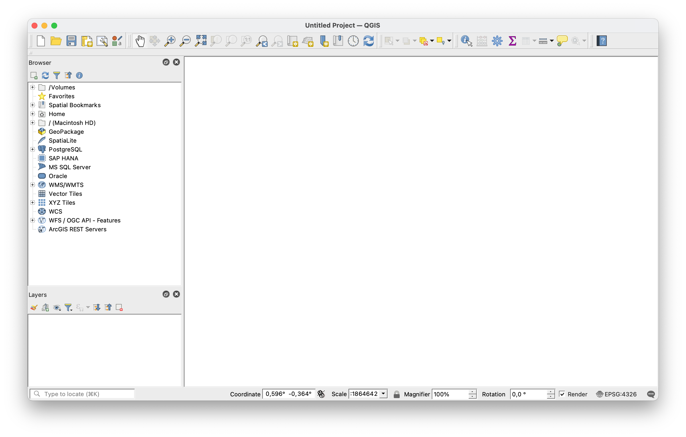
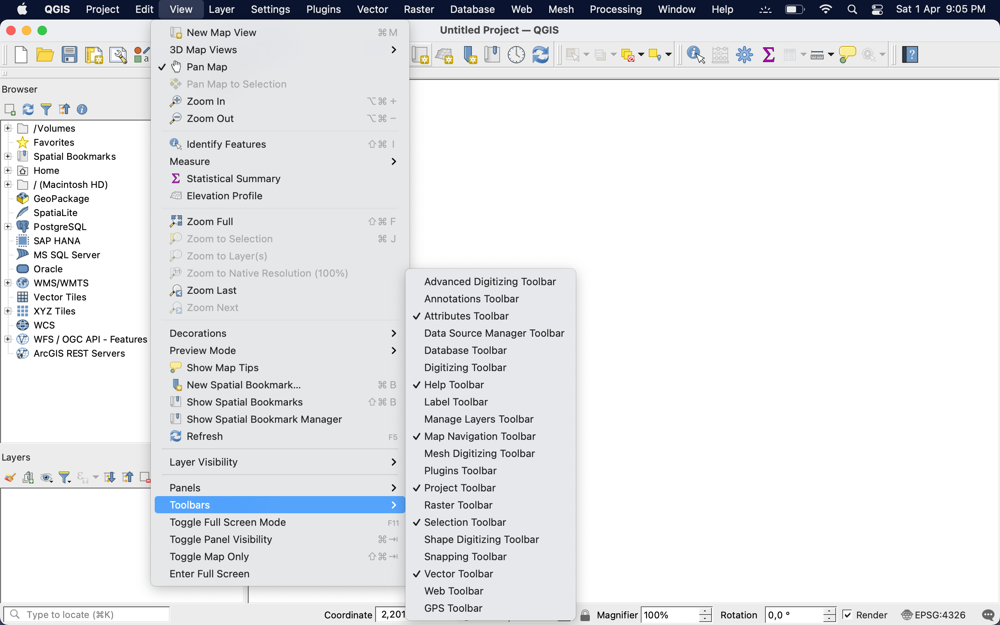
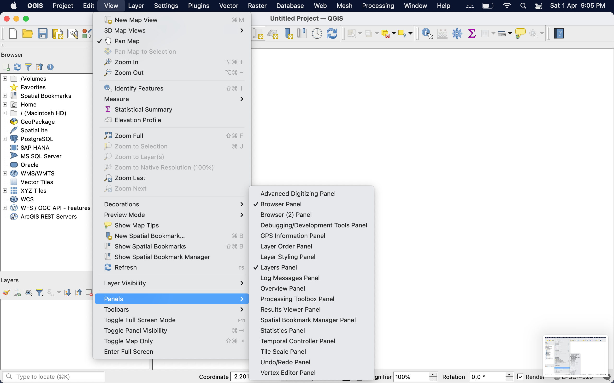

# Η Γραφική Διεπαφή Χρήστη (GUI) του QGIS

---

Η γραφική διεπαφή του QGIS αποτελείται από τα παρακάτω δομικά στοιχεία:

1. **Main menu**: το κυρίως μενού επιλογών. Σχεδόν κάθε εντολή είναι διαθέσιμη μέσω του κυρίως μενού.
2. **Toolbars**: Εργαλειοθήκες ή εργαλειομπάρες. Ομάδες εικονιδίων που παρέχουν γρήγορη πρόσβαση σε εντολές του προγράμματος.
3. **Map View**: η περιοχή θέασης του χάρτη
4. **Panels**: Πάνελ που παρουσιάζουν συγκεκριμένες πληροφορίες και επιτρέπουν συγκεκριμένες ενέργειες στον χρήστη. 
5. **Status bar**: Η γραμμή (ή μπάρα) κατάστασης, η οποία παρέχει πληροφορίες για την 

Τα πιο σημαντικά πάνελ είναι:
1. Το **Layer Panel**, δηλαδή το πάνελ διαχείρισης επιπέδων, το οποίο αποτελεί ένα είδος πίνακα περιεχομένων των θεματικών επιπέδων που φορτώνονται στο QGIS
2. Το **Browser Panel**, το οποίο μας παρέχει γρήγορη πρόσβαση σε φακέλους και δεδομένα του υπολογιστή μας. Αποτελεί έναν πίνακα εξερεύνησης του συστήματος αρχείων και των διαδικτυακών υπηρεσιών. Παρέχει δυνατότητα γρήγορης περιήγησης σε αρχεία και καταλόγους που περιέχουν γεωχωρικά δεδομένα, καθώς και σε υπηρεσίες που είναι διαθέσιμες μέσω του δικτύου ή του διαδικτύου. Αφού εντοπισθεί το επιθυμητό αρχείο (ή η υπηρεσία) μπορεί να γίνει άμεση μεταφορά (drag and drop) στον πάνελ των θεματικών επιπέδων (Layer Panel) 

---

---

Τόσο οι εργαλειοθήκες (toolbars) όσο και τα πάνελ (panels) μπορούν να αναδιαταχθούν, δίνοντας έτσι την δυνατότητα παραμετροποίησης του γραφικού περιβάλλοντος στον/στην χρήστη του λογισμικού.

Μπορούν επιπλέον να αποκρυφτούν και αν χρειαστεί να επαναφερθούν.

Η εμφάνιση και απόκρυψη των πάνελ γίνεται από το κυρίως μενού -> View -> Panels και στη συνέχεια επιλογή ή αποεπιλογή του πάνελ ενδιαφέροντος.

Με παρόμοιο τρόπο, εμφάνιση και απόκρυψη των εργαλειοθηκών γίνεται από το κυρίως μενού -> View -> Toolbars και στη συνέχεια επιλογή ή αποεπιλογή της εργαλειοθήκης ενδιαφέροντος. 

---

---

