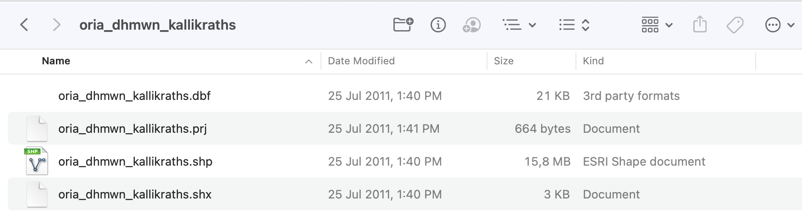

# Φόρτωση διανυσματικών δεδομένων στο QGIS

---

Συνοπτικά βήματα:
- Αρχικά, δημιουργούμε ένα φάκελο εργασίας στον υπολογιστή μας.
- Κατεβάζουμε τα απαραίτητα δεδομένα (shapefile) υπό τη μορφή αρχείων ZIP, είτε απευθείας από το geodata.gov.gr ή από τον φάκελο [Geodata](Geodata) στο παρόν αποθετήριο
- Αποσυμπιέζουμε τα αρχεία ZIP
- Φορτώνουμε κάθε ένα από τα shapefile ως θεματικό επίπεδο στο QGIS

---

Ένα από τα αποσυμπιεσμένα shapefile. Για λόγους καλύτερης οργάνωσης των αρχείων μας, καλό θα ήταν να διατηρήσουμε κάθε shapefile (και όλα τα αρχεία που το αποτελούν) σε ένα ξεχωριστό φάκελο.

---

Η φόρτωση shapefile γίνεται από το κυρίως μενού -> Layer -> Add Layer -> Add Vector Layer

---

---

Στη συνέχεια, επιλέγουμε το shapefile που θα φορτώσουμε. Πατώντας στο πλήκτρο με τις τρεις τελείες στο δεξί μέρος, θα εμφανιστεί ένα πλαίσιο διαλόγου. Στη συνέχεια θα αναζητήσουμε στον υπολογιστή μας τον φάκελο εργασίας μας και θα πρέπει να εντοπίσουμε το αρχείο του shapefile με προέκταση .shp (αποτελεί το αντιπροσωπευτικό αρχείο) και θα το επιλέξουμε.

Δεν χρειάζεται να τροποποιήσουμε κάποια από τις υπόλοιπες ρυθμίσεις.

---

---

Αν όλα έχουν πάει καλά, θα εμφανιστεί το shapefile με μια τυχαία απόχρωση που επιλέγεται από το QGIS (ο συμβολισμός στη συνέχεια μπορεί να τροποποιηθεί). 

Το shapefile αυτό αποτελεί πλέον ένα **"Θεματικό Επίπεδο"** (Layer) το οποίο έχει προστεθεί στο Layer Panel (στο κάτω δεξί μέρος της οθόνης με την επικεφαλίδα **Layers**, το οποίο λειτουργεί ως ένας πίνακας περιεχομένων και δείχνει τα αρχεία γεωχωρικών δεδομένων που έχουν φορτωθεί.

Αριστερά από το όνομα του Επιπέδου υπάρχει ένα check box με το οποιό μπορούμε προσωρινά να αποκρύψουμε ή να εμφανίσουμε το εκάστοτε Θεματικό Επίπεδο, χωρίς να χρειαστεί να το διαγράψουμε από το QGIS Project.

---

---

Επαναλαμβάνουμε τα παραπάνω βήματα έως ότου φορτώσουμε και τα 4 θεματικά επίπεδα

---

---

# Αποθήκευση του Project

Το τελευταίο βήμα θα είναι η αποθήκευση του Project του QGIS (θα το αποδίδαμε ως "Έργο" στα ελληνικά). 

Αυτό το αρχείο είναι καλό να το αποθηκεύσουμε **στον ίδιο φάκελο** στον οποίο έχουμε τοποθετήσει και τα δεδομένα μας. Ένα QGIS Project έχει προέκταση .gqz (συνήθως)

Για να αποθηκεύσουμε: από το κυρίως μενού -> File -> Save ή πατάμε στο εικονίδιο 

Στο αρχείο QGIS Project δεν αποθηκεύονται τα ίδια τα γεωχωρικά δεδομένα αλλα **σύνδεσμοι** (ένα είδος δείκτη) προς τα αρχεία των γεωχωρικών δεδομένων. Όπως θα περιγραφεί και σε επόμενη ενότητα, σε ένα αρχείο QGIS Project αποθηκεύονται και άλλα στοιχεία όπως π.χ. ο χαρτογραφικός συμβολισμός των θεματικών επιπέδων, τα στοιχεία της χαρτοσύνθεσης κ.α.