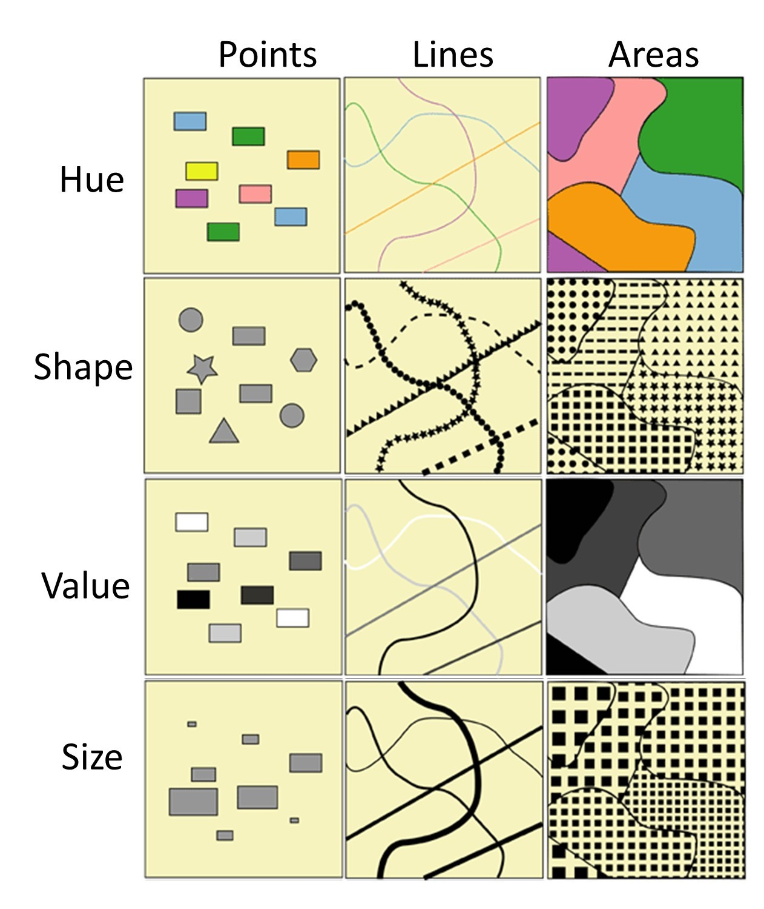
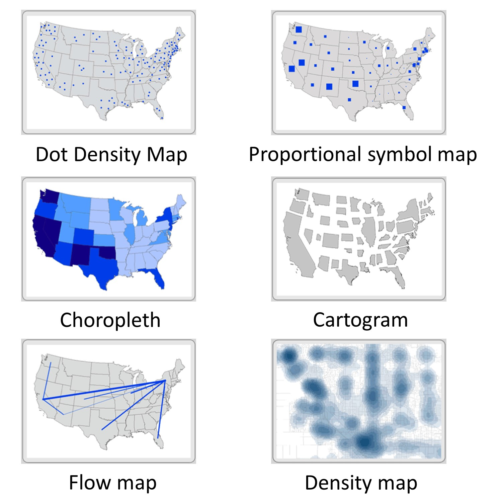

# Χαρτογραφικός συμβολισμός
[Πηγή](http://dx.doi.org/10.57713/kallipos-34)

Το σύνολο των αντικειμένων σε έναν χάρτη, απεικονίζονται με κάποιο **σύμβολο** το οποίο αντιστοιχεί σε ένα γεωγραφικό αντικείμενο του πραγματικού κόσμου.

Ο **χαρτογραφικός συμβολισμός (cartographic symbolization)** είναι ο όρος ο οποίος χρησιμοποιείται για να περιγράψει τον τρόπο με τον οποίο οπτικοποιούνται τα γεωγραφικά αντικείμενα σε έναν χάρτη. 

Ένας χαρτογράφος πρέπει να αποφασίσει με ποιον *συστηματικό* τρόπο θα συμβολίζεται κάθε αντικείμενο στον χάρτη, ώστε να βοηθά τον αναγνώστη να κατανοήσει γρήγορα αφενός το τι αντιπροσωπεύει και αφετέρου το βαθμό σημασίας του, σε σχέση με τα άλλα αντικείμενα του χάρτη

Τα δεδομένα που θέλουμε να συμβολίσουμε χαρτογραφικά  μπορεί να είναι **ποσοτικά** ή **ποιοτικά**.

# Ποιοτικά δεδομένα
Τα **Ποιοτικά δεδομένα (qualitative data)**, ή αλλιώς τα δεδομένα ονομαστικής κλίμακας, αναφέρονται στα ποιοτικά χαρακτηριστικά ενός πραγματικού φαινομένου τα οποία σχετίζονται με την ποιότητα (από όπου προέρχεται ο όρος «ποιοτικός») ή με άλλα λόγια αναφέρονται σε χαρακτηριστικά τα οποία διαφέρουν στο είδος ή στον τρόπο με τον οποίο δημιουργήθηκαν (π.χ. ένας χάρτης με τις πολυκατοικίες της Αθήνας οι οποίες διαθέτουν διαμερίσματα, τα οποία οι ιδιοκτήτες τους τα ενοικιάζουν βραχυχρόνια ή ένας χάρτης με τη θέση των δομών φιλοξενίας / προσωρινής υποδοχής των προσφύγων στην Ελλάδα)

# Ποσοτικά δεδομένα
Τα **Ποσοτικά δεδομένα (quantitative data)** αναφέρονται στις διαστάσεις (ή στις ποσότητες, οι οποίες μας δίνουν τον όρο «ποσοτικός») ενός πραγματικού φαινομένου (π.χ. ο αριθμός ασυνόδευτων ανηλίκων ανά δομή φιλοξενίας στην Ελλάδα ή η κατανομή των προσφύγων ανά εθνικότητα στις δομές αυτές).

# Κλίμακες μέτρησης θεματικών δεδομένων / γεωγραφικών μεταβλητών
Πηγές [1](https://en.wikipedia.org/wiki/Level_of_measurement), [2](https://el.wikipedia.org/wiki/Κλίμακες_μέτρησης), [3](https://dx.doi.org/10.1126%2Fscience.103.2684.677)

## Ονομαστική κλίμακα
Η ονομαστικής κλίμακα (**nominal ή categorical scale**) εμπλέκει δεδομένα που σχετίζονται με μεταβλητές των οποίων οι τιμές απεικονίζουν κατηγορίες που δεν διέπονται από την ιδιότητα της διάταξης ούτε από εκείνη της απόστασης, οπότε δεν μπορεί να γίνει κάποια σύγκριση, αριθμητική πράξη ή υπολογισμός στατιστικών μέτρων. Παραδείγματα τέτοιων μεταβλητών είναι: το φύλο, το επάγγελμα, η οικογενειακή κατάσταση.

## Τακτική κλίμακα
Η τακτική κλίμακας (**ordinal scale**) εμπλέκει δεδομένα που σχετίζονται με μεταβλητές των οποίων οι τιμές απεικονίζουν κατηγορίες οι οποίες μπορούν να μπουν σε μία διάταξη-σειρά, από μία κατώτερη σε μία ανώτερη. Δεν υπάρχει η ιδιότητα της απόστασης οπότε δεν μπορούμε να υπολογίσουμε το βαθμό διαφοράς ή το σχετικό μέγεθος μεταξύ δύο κατηγοριών. Παραδείγματα τέτοιων μεταβλητών είναι: το επίπεδο γνώσης κάποιου θέματος, το επίπεδο εκπαίδευσης, η θέση σε μία εταιρεία.

## Διαστημική/Αριθμητική κλίμακα
Η διαστημική κλίμακα (**interval scale)** αναφέρεται στη μέτρηση αριθμητικών δεδομένων, τα οποία ικανοποιούν την ιδιότητα της διάταξης αλλά και της απόστασης μεταξύ τους. Το 0, όμως, επιλέγεται αυθαίρετα, **δεν δηλώνει δηλαδή την απουσία** του μετρούμενου χαρακτηριστικού. Αποτέλεσμα είναι να μπορούμε να μελετήσουμε διαφορές όχι όμως και αναλογικές σχέσεις μεταξύ των τιμών των μεταβλητών. Χαρακτηριστικότερο παράδειγμα εδώ είναι η θερμοκρασία.

## Αναλογική κλίμακα 
Η αναλογική κλίμακα (**ratio scale**) αναφέρεται στη μέτρηση αριθμητικών δεδομένων τα οποία ικανοποιούν τις ιδιότητες της διάταξης και της απόστασης και ταυτόχρονα έχουν ορισμένη την τιμή "0" που αντιπροσωπεύει την **απουσία** του χαρακτηριστικού που μελετάται. Έτσι, εδώ μπορούν να μελετηθούν και αναλογικές σχέσεις μεταξύ των μεταβλητών, δηλαδή έχει νόημα και η διαίρεση και ο πολλαπλασιασμός, εκτός της πρόσθεσης και της αφαίρεσης ως πράξεις. Παραδείγματα είναι η ηλικία, το σωματικό βάρος, εμβαδό οικοπέδων, κλπ.

# Οπτικές μεταβλητές
[Πηγή](http://dx.doi.org/10.57713/kallipos-34)

Μπορούμε με πολλούς τρόπους να τροποποιήσουμε την εμφάνιση των βασικών γεωμετρικών αντικειμένων των χαρτών (σημεία, γραμμές και πολύγωνα). Οι παραλλαγές αυτών των γεωμετρικών αντικειμένων αναφέρονται ως **οπτικές μεταβλητές (visual variables)**, επειδή περιγράφουν τον τρόπο με τον οποίο μια δεδομένη οπτική οντότητα, όπως για παράδειγμα μια γραμμή, αλλάζει από σκούρο σε ανοιχτό χρώμα ή από γραμμή με μεγάλο πάχος σε λεπτή. Οι οπτικές μεταβλητές είναι σημαντικές για την εμφάνιση τόσο των ποιοτικών, όσο και των ποσοτικών δεδομένων. 

Οι τέσσερις κύριες οπτικές μεταβλητές οι οποίες χρησιμοποιούνται συνήθως στους χάρτες είναι: 
- το σχήμα
- το μέγεθος
- η απόχρωση και
- η ένταση

*Οι κυριότερες οπτικές μεταβλητές που χρησιμοποιούνται στην Χαρτογραφία*[Πηγή](https://open.lib.umn.edu/mapping/chapter/4-design-and-symbolization/)

## Το σχήμα (shape)
Τα σχήματα συχνά υποδηλώνουν διαφορές στο είδος, επομένως, είναι καλό να χρησιμοποιούνται για **ποιοτικά** δεδομένα. Υπάρχουν ορισμένες συμβάσεις στη χρήση των σχημάτων. Για παράδειγμα, θα χρησιμοποιήσουμε ένα αεροπλάνο για να αναπαραστήσουμε τη θέση ενός αεροδρομίου ή ένα σταυρό για να αναπαραστήσουμε τη θέση ενός νοσοκομείου. Τα σχήματα μπορούν επίσης να έχουν πολύ πιο συγκεκριμένες αναπαραστάσεις. Για να φτιάξουμε έναν χάρτη άγριας ζωής στον οποίο θα χωροθετήσουμε τους οικοτόπους τους, μπορούμε να χρησιμοποιήσουμε ως σχήμα απλές εικόνες διαφορετικών ειδών ζώων. Μπορούμε επίσης να χρησιμοποιήσουμε τα εταιρικά λογότυπα, για να απεικονίσουμε τις αντιπροσωπείες διαφορετικών μοντέλων αυτοκινήτων ή για να αναπαραστήσουμε αλυσίδες εστιατορίων.

## Μέγεθος (size)
Το μέγεθος είναι μια οπτική μεταβλητή ιδιαίτερα κατάλληλη για **ποσοτικά** δεδομένα. Τα μεγάλα μεγέθη συχνά θεωρείται ότι απεικονίζουν ένα αντικείμενο σε ένα συγκεκριμένο τόπο, υψηλότερης αξίας, ή σημασίας, ή τιμής, ενώ τα μικρά μεγέθη απεικονίζουν χαμηλότερες ή λιγότερο σημαντικές τιμές. Το μέγεθος περιορίζεται από την διακριτική ικανότητα του αναγνώστη του χάρτη να εκτιμήσει τη διαφορά μεταξύ των μεγεθών.

## Απόχρωση (hue)
 Όταν οι χαρτογράφοι συζητούν για χρώματα σε έναν χάρτη, συνήθως αναφέρονται σε αυτό το οποίο είναι τεχνικά γνωστό ως **απόχρωση**. Η απόχρωση χρησιμοποιείται συχνά για τη διάκριση μεταξύ **ποιοτικών** δεδομένων. Επειδή συσχετίζουμε συγκεκριμένα χρώματα με συγκεκριμένα αντικείμενα του πραγματικού κόσμου, οι αποφάσεις για τον συμβολισμό βασίζονται σε ψυχολογικούς και κοινωνικούς παράγοντες. Για παράδειγμα͘, το μπλε συνδέεται με το νερό, το πράσινο με το δάσος και το κόκκινο με την φωτιά ή τη ζέστη, με τέτοιο τρόπο δηλαδή ώστε να αντιστοιχεί στο χρώμα των φυσικών αντικειμένων. Το χρώμα στους χάρτες συνδέεται συχνά και με τα σύμβολα πολιτικών πεποιθήσεων, παραπέμποντας σε εκείνα τα οποία χρησιμοποιούν τα πολιτικά κόμματα τα οποία συνδέονται με αυτές. Είναι επίσης σύνηθες͘ το κόκκινο να χρησιμοποιείται για να υποδηλώσει την ένταση ή τη σπουδαιότητα, ενώ τα γαλήνια χρώματα όπως το μπλε ή το γκρι να χρησιμοποιούνται για να υποδηλωθεί κάτι μικρότερης έντασης.

*Διαφορετικές αποχρώσεις*[Πηγή](https://open.lib.umn.edu/mapping/chapter/4-design-and-symbolization/#footnote-399-12)

## Ένταση (value)
Η ένταση αναφέρεται στο βαθμό στον οποίο μια απόχρωση είναι **φωτεινή ή σκοτεινή**. Χρησιμοποιείται πιο συχνά για **ποσοτικά** δεδομένα, καθώς μπορεί να απεικονίσει τη σχετική βαρύτητα ή την ποσότητα σε μια συνεχή κλίμακα. Παρόλο ότι η διάκριση μεταξύ φωτεινού και σκοτεινού είναι αρκετά προφανής, απαιτείται προσοχή στη χρήση των διαφορετικών εντάσεων μιας απόχρωσης. Για την ακρίβεια, δεν πρέπει να χρησιμοποιούνται πάρα πολλές διαφορετικές εντάσεις σε έναν χάρτη και αυτό γιατί το ανθρώπινο μάτι δυσκολεύεται να διακρίνει περισσότερες από οκτώ, περίπου, τιμές έντασης.

*Διαφορετικές εντάσεις της ίδιας απόχρωσης*[Πηγή](https://open.lib.umn.edu/mapping/chapter/4-design-and-symbolization/#footnote-399-12)

# Ανακεφαλαίωση
- για τα ποσοτικά δεδομένα χρησιμοποιούμε το μέγεθος και την ένταση  
- τα ποιοτικά δεδομένα τα απεικονίζουμε με την απόχρωση και το σχήμα

# Ορισμένοι τύποι θεματικών χαρτών
[Πηγή](http://dx.doi.org/10.57713/kallipos-34)

- Οι **χάρτες πυκνότητας κουκκίδων** (dot density maps) ή αλλιώς χάρτες διάστιξης οι οποίοι χρησιμοποιούν κουκκίδες ή σημεία για να δείξουν τη συγκριτική πυκνότητα χαρακτηριστικών πάνω σε ένα χαρτογραφικό υπόβαθρο. Τα σημειακά σύμβολα, σε αυτό το χάρτη, έχουν όλα το ίδιο μέγεθος.
- Οι **χάρτες αναλογικών συμβόλων** (proportional symbol maps) χρησιμοποιούν σημεία ως σύμβολα σε έναν χάρτη, τα οποία ποικίλουν σε μέγεθος ανάλογα με την ποσότητα ή το μέγεθος του φαινομένου το οποίο χαρτογραφείται. Είναι το αντίθετο από τους χάρτες πυκνότητας κουκκίδων, στους οποίους το σημειακό σύμβολο είναι σταθερό σε μέγεθος. Γενικά στους χάρτες αναλογικών συμβόλων ισχύει η ακόλουθη σύμβαση: οι υψηλότερες τιμές αντιστοιχούν σε μεγαλύτερα σύμβολα.
- Οι **χωροπληθείς χάρτες** (choropleth maps) χρησιμοποιούνται πιο συχνά από οποιονδήποτε άλλο θεματικό χάρτη. Αναλυτικότερα, χρησιμοποιούν μια απόχρωση διαφορετικής έντασης για να απεικονίσουν ένα φαινόμενο το οποίο παίρνει διαφορετικές ανηγμένες τιμές −ποσοστά ή αριθμός ατόμων ανά π.χ. 1.000.000 κατοίκους− σε διάφορες χωρικές ενότητες. Η βασική διαφορά με τον χάρτη αναλογικών συμβόλων ο οποίος αναφέρεται σε απόλυτες τιμές, είναι ότι ο χωροπληθής χάρτης αναφέρεται σε ανηγμένες τιμές.
- Τα **χαρτογράμματα** (cartograms) παραμορφώνουν το σχήμα των περιοχών για να απεικονίσουν τη σημασία/σπουδαιότητα του χαρακτηριστικού το οποίο χαρτογραφείται. Μια σχετικά υψηλή τιμή ενός φαινομένου σε μια κατά κανόνα μικρή γεωγραφική μονάδα, όπως μια πολιτεία των ΗΠΑ ή ένας δήμος της Ελλάδας, θα απεικονίζεται με δυσανάλογα μεγάλο σχήμα σε ένα χαρτόγραμμα, και αυτό γιατί το μέγεθος της περιοχής της γεωγραφική μονάδας θα βασίζεται στις τιμές του φαινομένου και όχι στο πραγματικό μέγεθος της περιοχής.
- Οι **χάρτες ροής** δείχνουν τη μετακίνηση αγαθών, ανθρώπων και ιδεών μεταξύ διαφορετικών τόπων. Συνήθως αυτοί οι χάρτες απεικονίζουν το μέγεθος των ροών, αλλάζοντας το πάχος των γραμμών οι οποίες συνδέουν τα σημεία (Εικόνα 8.2, Χάρτης Ε).
●Οι χάρτες πυκνότητας απεικονίζουν τη συγκέντρωση των τιμών σημειακών χαρακτηριστικών. Ο χάρτης αυτός δείχνει το πώς κάθε τοποθεσία εξαπλώνει την παρουσία της πέρα από την άμεση θέση της για να συμπεριλάβει γειτονικές περιοχές.

*Τύποι θεματικών χαρτών*[Πηγή](https://open.lib.umn.edu/mapping/chapter/5-simplification/)

# Ο χαρτογραφικός συμβολισμός στο QGIS
[Πηγή](https://docs.qgis.org/3.28/en/docs/user_manual/working_with_vector/vector_properties.html#symbology-properties)

Με δεξί κλικ σε ένα θεματικό επίπεδο, το οποίο έχουμε ήδη φορτώσει στο QGIS και στη συνέχεια επιλέγοντας Properties και μετά την ενότητα "Symbology" (ή πιο σύντομα κάνοντας διπλό κλικ και "Symbology") εμφανίζονται τα διαθέσιμα εργαλεία που παρέχει το QGIS για την απόδοση χαρτογραφικού συμβολισμού στα γεωγραφικά αντικείμενα που περιέχονται στο θεματικό επίπεδο. Οι ενότητες που ακολουθούν περιγράφουν την διαδικασία συμβολισμού διανυσματικών επιπέδων.

Η καρτέλα "**Symbology**" παρέχει ένα περιεκτικό εργαλείο για την απόδοση και τον συμβολισμό των διανυσματικών δεδομένων. Παρέχονται εργαλεία που είναι κοινά για όλα τα διανυσματικά δεδομένα, καθώς και ειδικά εργαλεία συμβολισμού που σχεδιάστηκαν για τα διάφορα είδη διανυσματικών δεδομένων, ανάλογα το είδος του χάρτη τον οποίο σκοπεύει να φτιάξει κανείς. Σε όλες τις περιπτώσεις, η δομή του πλαισίου διαλόγου είναι κοινή: στο επάνω μέρος υπάρχει ένα widget που βοηθά στην προετοιμασία της ταξινόμησης και της ομαδοποίησης δεδομένων καθώς και στην μορφοποίηση του βασικού συμβόλου που θα χρησιμοποιηθεί για τα δεδομένα ενώ στο κάτω μέρος υπάρχει το widget απεικόνισης επιπέδων (Layer rendering ).

Το QGIS παρέχει ορισμένους διαφορετικούς τρόπους απόδοσης συμβόλων. Αυτοί οι τρόποι ονομάζονται **renderers**. Κάθε renderer είναι υπεύθυνος για τη σχεδίαση ενός χαρτογραφικού αντικειμένου μαζί με το  σύμβολο του. Ανεξάρτητα από τον τύπο γεωμετρίας του επιπέδου στο οποίο εφαρμόζεται, το QGIS παρέχει πέντε τύπους renderers: 

- **No symbol**:  Με τη χρήση αυτού του renderer δεν θα σχεδιαστεί κανένα σύμβολο για τα αντικείμενα
- **Single symbol:** εφαρμόζεται απόδοση ενιαίου συμβόλου σε όλα τα αντικείμενα, άρα όλα τα αντικείμενα απεικονίζονται με το ίδιο σύμβολο.
- **Categorized**: η απόδοση του συμβόλου γίνεται με βάση κάποια κατηγοριοποίηση, όπου οι τιμές που θα χρησιμοποιηθούν είναι σε ονομαστική κλίμακα και σε κάθε τιμή αποδίδεται διαφορετικό σύμβολο.
- **Graduated**: η απόδοση του συμβόλου με βάση κάποια διαβάθμιση ποσοτικής (συνήθως) τιμής η οποία συσχετίζεται με τη διαβάθμιση του χρώματος ή του μεγέθους του συμβόλου: οπότε το χρώμα ή το μέγεθος του συμβόλου είναι ανάλογο της εκάστοτε τιμής.
- **Rule-based**: η απόδοση του συμβόλου βασίζεται σε κανόνες που ορίζονται από τον χρήστη. 

## No symbol (χωρίς σύμβολο)
Με τη χρήση αυτού του renderer, δεν θα σχεδιαστεί κανένα σύμβολο για τα αντικείμενα. Η επιλογή αυτή προορίζεται, μεταξύ άλλων, ως ένας σύντομος τρόπος για την εμφάνιση μόνον της ονοματολογίας ενός επιπέδου, δηλαδή μόνο των ετικετών (labels) των αντικειμένων.

## Single Symbol: ενιαίο σύμβολο σε όλα τα αντικείμενα

*Η ενότητα "Symbology" σε ένα θεματικό επίπεδο, όπου έχει επιλεχθεί ο τρόπος απόδοσης συμβόλου με ενιαίο σύμβολο (Single Symbol)*

Επιλέγοντας την μέθοδο του ενιαίου συμβόλου χρησιμοποιείται για την απόδοση όλων των χαρακτηριστικών του στρώματος χρησιμοποιώντας ένα μοναδικό και ενιαίο σύμβολο που έχει οριστεί από τον χρήστη. Η επιλογή αυτή είναι κατάλληλη όταν το επίπεδο χρησιμοποιείται ως υπόβαθρο και δεν είναι επιθυμητή η  χαρτογραφική διάκριση μεταξύ των αντικειμένων.

## Categorized: Δημιουργία κατηγοριών και απόδοση διαφορετικών συμβόλων 
Αυτή η μέθοδος χρησιμοποιείται για την απόδοση διαφορετικών συμβόλων στα αντικείμενα ενός επιπέδου, χρησιμοποιώντας ένα βασικό σύμβολο που ορίζεται από τον χρήστη. Αυτή η μέθοδος είναι ιδιαίτερα κατάλληλη για την χαρτογραφική απόδοση τιμών σε ονομαστική κλίμακα.

*Η ενότητα "Symbology" σε ένα θεματικό επίπεδο, όπου έχει επιλεχθεί ο τρόπος απόδοσης συμβόλου ανά διακριτές κατηγορίες (Categorized)*

## Graduated renderer: Διαβάθμιση χρώματος ή μεγέθους
Η επιλογή αυτή χρησιμοποιείται για την σχεδίαση όλων των αντικειμένων ενός επιπέδου χρησιμοποιώντας ένα σύμβολο του οποίου το χρώμα ή το μέγεθος αντικατοπτρίζει την τιμή μιας ιδιότητας του αντικειμένου. Συνήθως, η διαβάθμιση αυτή γίνεται ορίζοντας αυτόματα κάποια διαστήματα τιμών, με μία από τις διαθέσιμες **μεθόδους ομαδοποίησης**. Είναι ιδιαίτερα κατάλληλη μέθοδος για την χαρτογραφική απόδοση τιμών σε αριθμητική, συνεχή κλίμακα. 

*Η ενότητα "Symbology" σε ένα θεματικό επίπεδο, όπου έχει επιλεχθεί ο τρόπος απόδοσης συμβόλου με διαβάθμιση του χρώματος στην συγκεκριμένη περίπτωση (Graduated)*

Σε ό,τι αφορά τις μεθόδους ομαδοποίησης, οι πλέον σημαντικές τις οποίες υποστηρίζει το QGIS είναι οι παρακάτω:

- **Equal count** (Quantile, γνωστή και ως μέθοδος ποσοστημορίων). Ο χρήστης ορίζει τον αριθμό διαστημάτων και η μέθοδος υπολογίζει το εύρος κάθε διαστήματος ώστε να αντιστοιχεί ο ίδιος αριθμός αντικειμένων σε κάθε διάστημα.
- **Equal Interval** (Μέθοδος Ίσων Διαστημάτων): Ο χρήστης ορίζει τον αριθμό διαστημάτων και η μέθοδος υπολογίζει κάθε διάστημα ώστε να έχει το ίδιο εύρος (π.χ. με τις τιμές από 1 έως 16 και 4 διαστήματα, κάθε διάστημα θα έχει εύρος 4).
- **Logarithmic scale** (Λογαριθμική κλίμακα): κατάλληλη για δεδομένα με μεγάλο εύρος τιμών. Η μέθοδος δημιουργεί μικρού εύρους διαστήματα για τις χαμηλές τιμές και μεγάλου εύρους διαστήματα για τις μεγάλες τιμές (π.χ. για δεκαδικούς αριθμούς με εύρος 0..100 και δύο κλάσεις, η πρώτη κλάση θα είναι από 0 έως 10 και η δεύτερη κλάση από 10 έως 100).
- **Natural Breaks** (Jenks, γνωστή και ως μέθοδος Φυσικών Διακοπών): ο χρήστης ορίζει τον αριθμό διαστημάτων και η μέθοδος φροντίζει ώστε η εσωτερική διακύμανση των τιμών εντός κάθε διαστήματος να ελαχιστοποιείται και ταυτόχρονα η διακύμανση μεταξύ των διαστημάτων να μεγιστοποιείται.

# Δημιουργία χωροπληθούς χάρτη με τα δεδομένα της απογραφής της ΕΛΣΤΑΤ από το έτος 2021

